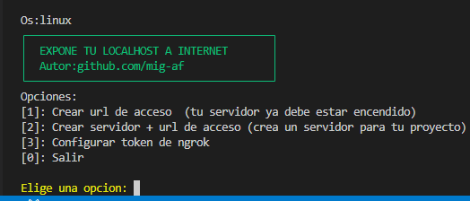

# easyLocalExpose



Herramienta de linea de comandos escrita en Go facil de usar para exponer servicios locales a internet vía túneles de ngrok, unica instalacion sin dependencias extras

## Caracteristicas

- Binario único sin instalador ni dependencias (16MB)
- Disponible para windows y linux
- Crea un simple tunel de acceso
- Crea un servidor y tunel de acceso a la vez
- Configuracion de token ngrok y guardado de forma segura

## Requisitos

Token de ngrok (gratis): [dashboard.ngrok.com/get-started/your-authtoken](https://dashboard.ngrok.com/get-started/your-authtoken)


## Instalación


- Windows [click para la descarga](https://github.com/mig-af/scripts/raw/refs/heads/main/easyLocalExpose/builds/easyTunnel.exe)
- Linux [click para la descarga](https://github.com/mig-af/scripts/raw/refs/heads/main/easyLocalExpose/builds/easyTunnel)

## Uso

```
$ ./easyLocalExpose

Opciones:
[1]: Crear url de acceso  (tu servidor ya debe estar encendido)
[2]: Crear servidor + url de acceso (crea un servidor para tu proyecto)
[3]: Configurar token de ngrok
[0]: Salir
```

- **`1`** — tunel directo: ngrok apunta a un puerto local donde ya debe haber un servidor corriendo.
- **`2`** — levanta un servidor local y abre el túnel los dos pasos al mismo tiempo.
- **`3`** — Edita, elimina, carga el token de ngrok (necesario).


##


## Autor

- [mig-af](https://github.com/mig-af)
---